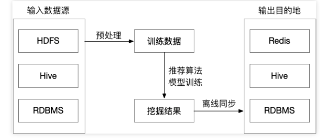
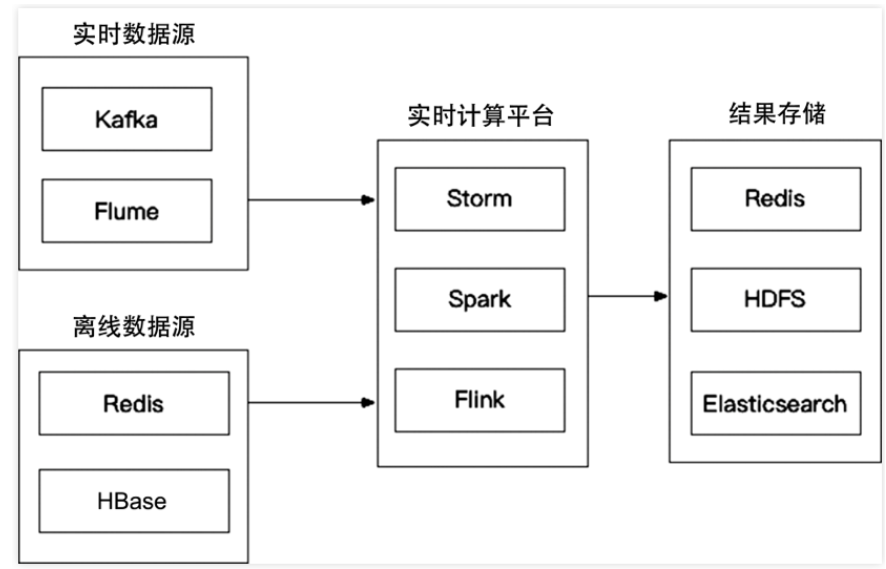
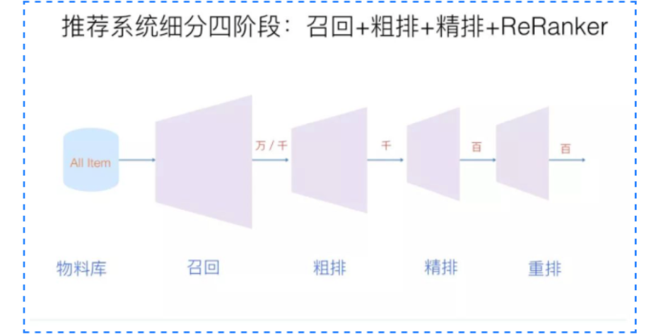
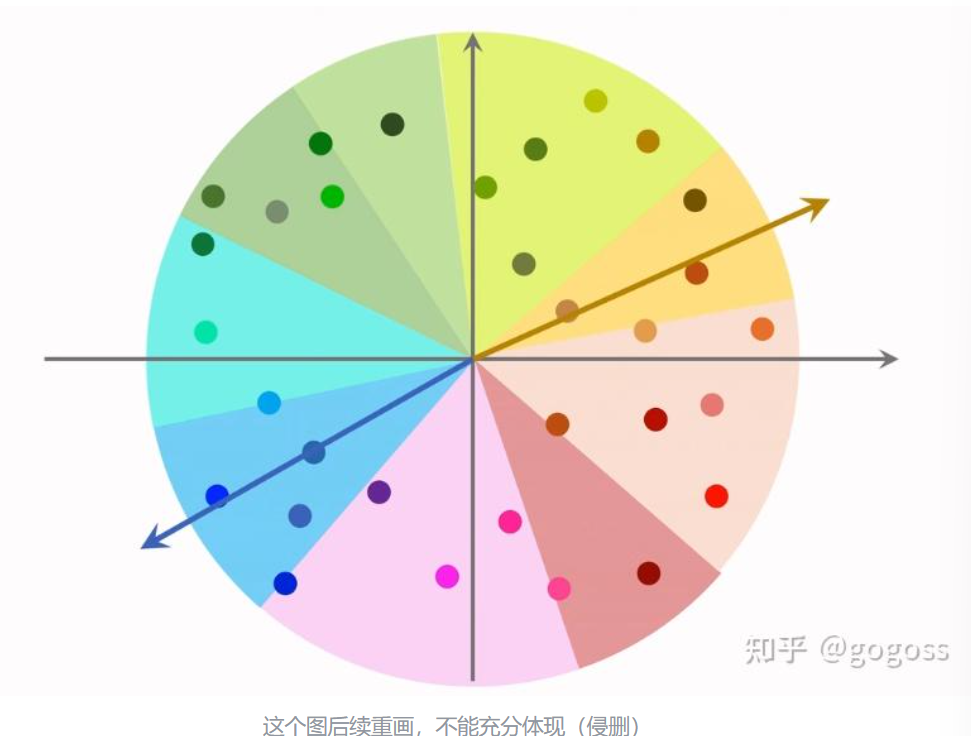

# 基本概念
## 消费指标
### 短期指标
- 点击率=点击次数/曝光次数
- 点赞率=点赞次数/点击次数
- 收藏率=收藏次数/点击次数
- 转发率=转发次数/点击次数
- 阅读完成率=滑动到底次数/点击次数*f(笔记长度)  归一化函数
### 北极星指标
- 用户规模
    - 日活用户数DAU
    - 月活用户数MAU
- 消费
    - 人均使用推荐的时长
    - 人均阅读笔记的数量
- 发布
    - 发布渗透率
    - 人均发布量
## 实验流程
- 离线实验——历史数据，没有部署
- 小流量AB测试——实际部署，对比测试
- 全流量上线
### AB测试
- 随机分桶，对照组
- 为了解决流量不够的问题，可以使用分层实验
    - 同层互斥——比如说召回层分成是个桶，对于一个GNN实验可能占用4个桶其中3个实验1个对照
    - 不同层正交——每一层独立随机对所有用户分桶，召回层1号桶和粗排层1号桶交集很小
    - 可以允许一个用户受不同层实验的影响，也就是说召回层一个桶的实验用户可能是打撒在粗排层的各个桶中
- holdout——使用10%作为对照组，在剩下90%的用户身上做实验，计算指标，查看diff，考核周期结束后清楚holdout桶，推全，holdout可以考察整个部门对业务指标的贡献
- 实验推全——会新开一层，推全到90%的用户
- 反转实验——有些指标有滞后性，希望尽快推全，也希望长期效果。可以在新策略的新层中开一个旧策略的桶，去长期比较新旧策略的diff
# 系统架构
## 整体架构
- 离线层：不用实时数据，不提供实时响应；
- 近线层：使用实时数据，不保证实时响应；
- 在线层：使用实时数据，保证实时在线服务；、
### 设计思想
- 客户端及服务器实时数据处理、流处理平台准实时数据处理和大数据平台离线数据处理
    
- 客户端和服务端的实时数据处理，埋点，记录用户数据
- 流处理平台准实时数据处理，准实时存在误差的即时数据，比如用户的行为数据，在这个行为前还做了什么行为，通过消息队列缓存来准实时
- 大数据平台离线数据处理，离线数据处理，数据量大

### 离线层
- 处理数据、训练模型

- 可以处理大量的数据，进行大规模特征工程；可以进行批量处理和计算；不用有响应时间要求；

### 近线层
- 特征的事实更新计算，解决特征分布不一致
- 实时训练数据的获取
- 模型实时训练，可以通过在线学习的方法更新模型，实时推送到线上；

### 在线层
- 所有的用户请求都会发送到在线层，在线层需要快速返回结果
- 将离线层的数据和在线层的实时数据进行拼接，快速召回排序吗，利用近线层的模型进行实时计算，返回结果

## 算法架构
- 召回、粗排、精排、重排
 
- 召回——不需要十分准确，但不可遗漏，快速低延迟，有很多召回通道
- 粗排——召回的结果还是太多，精排层速度还是跟不上，目前也模型化，训练样本类似精排，一般是机器学习模型，快速打分
- 精排——获取粗排模块的结果，对候选集进行打分和排序，传统概念上的算法层，专注于模型调优，一般是深度学习模型，特征更多，打分更可靠
- 重排——精排更多是point wise，重排更关注list wise，增强上下文能力，对精排结果分数进行进一步排序，考虑多样性，利用规则打散

# 召回

## 协同过滤
- UserCF——给用户推荐和他兴趣相似的用户喜欢的物品，计算与其他用户的相似度
- ItemCF——给用户推荐和他之前喜欢的物品相似的物品，计算与其他物品的相似度

### 相似性度量方法
- 杰卡德系数——通常用来判断两个集合的相似性，两个集合的交集除以并集，评估用户是否会对某物品进行打分， 而不是预估用户会对某物品打多少分
- 余弦相似度——计算两个向量的夹角，夹角越小，相似度越高。令矩阵A为用户-物品交互矩阵，矩阵的行表示用户，列表示物品。用户-物品交互矩阵在现实中是十分稀疏的，为了节省内存，交互矩阵会采用字典进行存储
- 皮尔逊相关系数——皮尔逊相关系数通过使用用户的平均分对各独立评分进行修正，减小了用户评分偏置的影响
- 使用场景
    - Jaccard 相似度表示两个集合的交集元素个数在并集中所占的比例 ，所以适用于隐式反馈数据（0-1）。
    - 余弦相似度在度量文本相似度、用户相似度、物品相似度的时候都较为常用。
    - 皮尔逊相关度，实际上也是一种余弦相似度。不过先对向量做了中心化，范围在-1到1。相关度量的是两个变量的变化趋势是否一致，两个随机变量是不是同增同减。不适合用作计算布尔值向量（0-1）之间相关度。

### 算法评估
- 准确率、召回率、覆盖率、新颖度

### 问题
- 协同过滤存在稀疏矩阵的问题，可以通过矩阵分解解决

### UserCF
- 要对用户A进行物品推荐，可以先找到和他有相似兴趣的其他用户。然后，将共同兴趣用户喜欢的，但用户A没交互过的物品推荐给用户A
- 先计算用户相似度，然后根据相似度最高的几个用户，根据他们对A用户未交互物品的打分计算A用户对物品的打分，得到未交互物品的分数，然后根据物品打分进行排序，推荐给用户A
- 缺点——用户可能购买1%的商品，重叠度很低；找TopK相似用户，计算量很大
- 用户相似度的计算需要降低热门物品权重，相似度的计算需要$\sum_{i \in I}\frac{1}{log(1+n_i)}$正则化，$n_i$是喜欢物品i的用户数量，越热门的物品权重越小，否则越容易推荐热门物品，因为热门物品大家都喜欢
- 离线计算索引，用户-物品，用户-用户
### ItemCF
- 预先根据所有用户的历史行为数据，计算物品之间的相似性。然后，把与用户喜欢的物品相类似的物品推荐给用户
- 如果用户 1 喜欢物品 A ，而物品 A 和 C 非常相似，则可以将物品 C 推荐给用户1。ItemCF算法并不利用物品的内容属性计算物品之间的相似度， 主要通过分析用户的行为记录计算物品之间的相似度， 该算法认为， 物品 A 和物品 C 具有很大的相似度是因为喜欢物品 A 的用户极可能喜欢物品 C
- 两个物品受众重合度高则相似
- 离线做索引，两个索引，用户-物品（id,like），物品-物品（id,sim），线上做召回，线上计算量小
### Swing
- Swing算法是ItemCF算法的改进，避免小圈子，用户需要广泛且多样
- 用户重合度overlap为两个用户喜欢物品的交集，放在分母上，越大说明越是小圈子
## 向量召回
### 离散特征处理
- 简历字典
- 向量化
    - Onehot：高维稀疏
    - Embedding：低维稠密，参数数量=向量维度x类别数量，Embedding=参数矩阵xOnehot
### 矩阵补充
- 将一个含有缺失值的矩阵通过一定的方法将其补全为一个完全的矩阵
- 两个embedding矩阵，一个用户一个物品，每一列代表一个用户或者物品，计算内积$<a_u,b_i>$即第u号用户对第i号物品兴趣的预估值，训练模型的目的是学习矩阵A、B
- 训练集是一个三元组（用户id，物品id，兴趣分数），求解优化问题，最小二乘作为损失函数
- 因为系统曝光给用户的物品只有很小部分，所以这个矩阵中只有绿色位置有用户对物品的兴趣分数；而因为系统没有曝光给用户某些物品，对应灰色位置没有分数。矩阵补全就是利用绿色位置的数据集来训练模型，利用训练好的模型再来预估灰色位置的兴趣分数，以实现补全用户对物品的兴趣分数矩阵。换言之，系统想要预估用户对未曝光物品的兴趣分数，可以通过已有用户对曝光物品的兴趣分数数据集训练模型，利用这个模型实现预估。
- 效果不好，仅用id没有利用属性；负样本选取不对；训练方法不好，内积不如余弦相似度，平方损失（回归）不如交叉熵（分类）
### 最近邻查找
- 矩阵补充后保存AB，用户A矩阵key-value表存储，根据用户id查找kv表，查到向量a，以内积作为预估值，最近邻找到k个物品最为召唤结果，但是计算量很大与物品速度成正比
- 衡量最近邻的标准有欧式距离最小、向量内积最大、余弦相似度最大（夹角最小）
- 一种ANN（近似最近邻查找）的例子
    - m个物品通过embedding得到物品向量，分布在n个小区域中，每个区域用单位向量表示，因为使用余弦相似度，所以每一个区域就是一个扇形
    - 以该区域表示向量作为key，区域中所有t个物品的列表作为value，n个区域就有n个索引
    - 线上召回a和nge索引计算相似度O(n)
    - 找到相似度最高的索引，分别计算区域内t个物品向量与a的相似度O(t)
    - 找到topk作为召回结果从O(m)->O(n+t)

### 双塔模型
- 矩阵补充模型只用到了用户物品id做embedding，双塔模型将用户物品id和属性都做embedding
- 用户和物品塔使用了用户和物品的多维特征，他们都是一些经过embedding的向量或者对于将连续数据进行归一化处理，然后拼接经过神经网络处理得到用户和物品的表征
- 两个塔的相似度计算使用余弦相似度：后期融合——后期融合是在计算相似度的时候才进行融合，而如果融合后经过一个神经网络那是排序模型的前期融合
#### 双塔模型训练
- pointwise——一个用户，一个正样本(1)或者一个负样本(-1)，正负样本1：2或者1：3做分类，交叉熵损失
- pairwise——一个用户一个正样本一个负样本（三元组），鼓励用户与正样本的余弦相似度大于鼓励用户与负样本的余弦相似度，大m这个m是一个超参数在损失函数中，通过训练获得，合页损失，Triplet Hinge Loss和Triplet Logistic Loss
- listwise——一个正样本多个负样本，鼓励用户与正样本的余弦相似度尽量大，与每个负样本的余弦相似度都尽量小，Sampled Softmax Loss，余弦相似度过一层softmax，与label（1，0）交叉熵
#### 正负样本
- 正样本：曝光后，用户点击的物品，但是28定律导致正样本大多是热门物品，所以可以降采样（抛弃一些）热门，过采样（一个出现多次）冷门
- 负样本：简单负样本、困难负样本、没用负样本
    - 不能把曝光（曝光的意思就是最后推荐系统推荐给用户的物品）但是没有点击的作为召回负样本，但是可以作为排序负样本
    - 训练时混合一半简单负样本一半困难负样本
    - 没用负样本——曝光但是没点击，用户感兴趣但是碰巧没点击
#### 线上召回
- 物品向量离线计算存在向量数据库中，用户塔向量现算一个，然后最近邻查找数据库
    - 每做一次召回所用到的用户向量数量为1，而物品向量数量为几亿，线上计算物品向量的代价太大。
    - 用户的兴趣是动态变化的，而物品特征相对稳定。虽然可以离线存储用户向量，但是不利于实时的推荐结果。
#### 模型更新
- 增量更新不同时间段的用户行为不一样，从统计学的角度出发，以天为总体，小时级的数据是有偏的，而分钟级别的数据偏差更大；
- 全量更新random shuffle了一天的数据，而增量更新按照数据从早到晚的顺序做训练。一般来说，训练时，随机打乱是优于按顺序排列的数据。故全量训练往往优于增量训练。
- 全量更新是拿前一天的数据在前一天的模型上更新one epoch
- 增量更新是实时数据实时更新ID embedding层
### 自监督模型
- 目的是把双塔模型的物品塔训练的更好
- 基于双塔模型的推荐系统存在严重的头部效应：因为少部分物品占据大部分点击次数，大部分物品点击次数不多，所以推荐系统对高点击物品的表征学的好，对长尾物品的表征学习困难。所以，引用自监督学习的思想，做data argumentation，可以更好地学习长尾物品的表征。
- 物品经过特征变换转换为两个表征向量，同一个物品的两个向量表征相似度高，而不同物品的向量表征相似度低
#### 特征变换
- 都是选取一些离散特征
- random mask
- dropout
- 互补特征
- mask一组关联的特征——使用互信息（MI，mutual information）衡量关联度，离线计算特征两两之间的关联矩阵，根据关联矩阵进行特征的随机Mask。
#### 训练模型
- 全体物品均匀抽样
#### 自监督+双塔
- 对点击做随机抽样，n对用户-物品组，作为一个batch
- 从全体物品中均匀抽样，m个物品，作为一个batch
- 梯度下降，双塔和自监督损失和最小，使用α调整自监督的影响程度
### Deep Retrieval
- 双塔模型线上做KNN，DR把物品表征作为路径path，线上查找用户匹配的路径，从而召回物品，使用dl而不是knn
#### 索引
- 物品表征为路径
- 物品-路径：一个物品表示为多条路径
- 路径-物品：一个路径对应多个物品
#### 预估模型
- 类似生成模型的贝叶斯概率相乘思路，用户表征向量经过神经网络+softmax得到第一层选择a，将用户x和emb（a）输入下一个神经网络最为第二层结果，依此类推得到路径长度
#### 线上召回
- 用户-路径-物品
- beam search——每次选择k个，k越大计算量就越大
- 选出来的物品作为一个子集，再用一个小的模型进行打分
#### 训练
- 同时学习神经网络参数和物品表征
- 只用正样本，如果用户点击过说明用户对物品对应的J条路径感兴趣
- 训练的时候同时学习用户路径和物品路径的关系，用户路径损失函数为-log（P），P为多条路劲的累加和吗，这里更新的是神经网络，判断用户对路径的兴趣
- 在更新物品表征的时候，用户是物品和路径的中介，用户点击过物品则说明物品与路径有关系，需要正则，一个路径不能有太多的物品
### 其他召回通道
- GeoHash召回：地理位置的优质笔记
- 同城召回：城市召回优质笔记
- 作者召回：两个索引用户-作者，作者-笔记
- 有交互作者召回：交互，可能是没有关注的
- 相似作者召回
- 缓存召回：复用前n次精排的结果，缓存大小固定需要退场机制，LRU或者时间、召回次数
### 曝光过滤
- 避免重复推荐，用户看过就不曝光了
#### bloom filter
- 暴力对比计算量太大，用户看过的笔记和召回的笔记都要计算O（nr），使用bloom filter，空间换时间
- kafka+flink实时流处理
- 召回完成后经过曝光过滤送到排序层

# 排序
粗排精排都是排序，只是神经网络的深度和规模不同，但都是对召回后的物品进行排序的操作
## 多目标模型
### 排序依据
- 排序模型预估点击率、点赞率、收藏率、转发率等
- 融合这些分数
- 根据这些融合的分数进行排序截断
- 特征有很多：用户特征、物品特征、统计特征（用户和物品，比如用户30天内点赞笔记数量，物品30天内多少次曝光机会）、场景特征（用户所在时间、地点）；多个特征拼接后送到神经网络中，然后经过多个指标的神经网络输出指标预估值
### 模型训练
- 多个指标的二分类，损失函数为多个指标的交叉熵损失和，对损失函数求梯度
- 最大的困难是类别不平衡，负样本远远多于正样本，需要进行负样本降采样
### 预估值校准
- 对负样本降采样，采样率为α，所以模型预估点击率大于真实点击率
- 根据预估点击率，得到真实点击率公式
- 校准意义：
    - 如果只是考虑排序那么校准与否，排名不会发生变化
    - 但是多目标模型涉及多个指标结果的相乘或计算，而且多目标任务不校准无法统一量纲
    - 广告系统中，点击率参与广告计费，必须校准
## MMoE
- 对于不同的目标，融合特征之后利用专家获得多个表征向量，同时分别利用神经网络得到不同的权重，最后对向量加权平均输出预估值
- 专家是超参数，4或8个神经网络
- 模型下层结构就是特征拼接->专家+权重神经网络;模型上层结构是权重+多个表征向量加权平均->指标神经网络
- 权重的神经网络就是有几个指标就几个，专家和这些权重网络都是不共享参数的
### 极化现象
- softmax结果只有一个接近1，其余接近0，相当于没有用到所有的专家
- 使用dropout解决，softmax输出mask的概率是10%
## 预估分数融合
- 通过mmoe获得了多个预估分数包括点击率、点赞率、收藏率等，需要进行融合
- ensemble sort：用的不是分数而是排名
- 超参数要调
## 视频播放建模
- 视频需要考虑播放时长和完播率，一般对于视频来说这两个指标的重要性更高
- 图文笔记一般是点击点赞收藏转发
### 视频播放时长
- 视频的播放时长是连续型变量，直接用回归拟合播放时长效果不好，Youtube的方法是多目标模型，输出使用sigmoid函数，然后与真实播放时长交叉熵损失，得到exp(z)作为播放时长的预估
### 视频完播率
- 两种方法：
    - 回归方法：拟合，交叉熵
    - 二元分类：自己定义完播指标，自定义正负样本
- 不能直接将预估的完播率用到融分公式，视频的时长越长，它的完播率越低，需要进行调整，完播率/f（视频时长）
## 排序模型的特征
- 用户和物品的多维特征
### 特征处理
- 离散特征：embedding
- 连续特征：离散化分桶、log（1+x）、平滑
- 除了考虑异常值、缺失值还要考虑特征覆盖率
### 数据服务
- 用户请求->主服务器->召回服务器->主服务器->排序服务器->数据服务器->排序服务器->TF server（获得预估分数）
## 粗排
- 双塔后期融合，快速召回；精排前期融合，结果准确
### 三塔模型
- 用户塔（用户特征、场景特征）、物品塔（静态物品特征）、交叉塔（统计特征、交叉特征），经过三个塔后拼接再送到指标层中
- 只有一个用户用户塔只做一次推理，用户塔很大；n个物品理论上n次推理，但是可以缓存，物品变换小，也可以较大；交叉塔动态变化需要小一点
- 上层推理的计算量更大，n次推理给n个物品打分
# 特征交叉
## FM
- 特征交叉可以提升模型的表达能力，之前都是线性结构，简单的特征拼接
- 二阶特征交叉参数量大，权重矩阵$O(d^2)$，可以进行低秩矩阵分解，$O(kd)$，减少参数量，k << d
- 现在不用了
## DCN深度交叉网络
- 排序召回，代替简单的全连接网络
- 双塔的物品塔用户塔可以是DCN，排序的MMoE的专家可以是DCN
### 交叉层
- $x_{i+1}=x_0\cdot(wx_i+b)+x_i$ w是一个全连接层
### 交叉网络
- 交叉层堆叠，输入输出都是向量
### 深度交叉网络
- 用户物品特征拼接，分别输入全连接网络和交叉网络，得到的向量拼接输入全连接层，得到输出
## LHUC网络结构（PPNet）
- 只用于精排，类似于DCN，用于专家网络或者shared bottom
- 物品特征相当于语音信号，用户特征相当于说话者的特征
## SENet 
- 对特征进行动态加权
- 对离散特征做field-wise加权：若某特征的embedding是n维向量，称向量中的n个元素归为一个field,获得相同的权重；如果m个field那么权重向量是m维；不同特征的embedding维度可以不同
- row-wise multiply将矩阵的每一行和向量的每个元素相乘，得到一个与原矩阵shape相同的矩阵
- m个特征需要进行r的降维，再升维，类似unet
