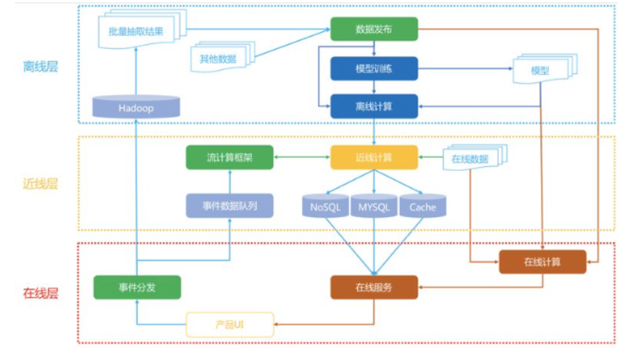

# 基本概念
## 消费指标
### 短期指标
- 点击率=点击次数/曝光次数
- 点赞率=点赞次数/点击次数
- 收藏率=收藏次数/点击次数
- 转发率=转发次数/点击次数
- 阅读完成率=滑动到底次数/点击次数*f(笔记长度)  归一化函数
### 北极星指标
- 用户规模
    - 日活用户数DAU
    - 月活用户数MAU
- 消费
    - 人均使用推荐的时长
    - 人均阅读笔记的数量
- 发布
    - 发布渗透率
    - 人均发布量
## 实验流程
- 离线实验——历史数据，没有部署
- 小流量AB测试——实际部署，对比测试
- 全流量上线
### AB测试
- 随机分桶，对照组
- 为了解决流量不够的问题，可以使用分层实验
    - 同层互斥——比如说召回层分成是个桶，对于一个GNN实验可能占用4个桶其中3个实验1个对照
    - 不同层正交——每一层独立随机对所有用户分桶，召回层1号桶和粗排层1号桶交集很小
    - 可以允许一个用户受不同层实验的影响，也就是说召回层一个桶的实验用户可能是打撒在粗排层的各个桶中
- holdout——使用10%作为对照组，在剩下90%的用户身上做实验，计算指标，查看diff，考核周期结束后清楚holdout桶，推全，holdout可以考察整个部门对业务指标的贡献
- 实验推全——会新开一层，推全到90%的用户
- 反转实验——有些指标有滞后性，希望尽快推全，也希望长期效果。可以在新策略的新层中开一个旧策略的桶，去长期比较新旧策略的diff
# 系统架构
## 整体架构
- 离线层：不用实时数据，不提供实时响应；
- 近线层：使用实时数据，不保证实时响应；
- 在线层：使用实时数据，保证实时在线服务；、
### 设计思想
- 客户端及服务器实时数据处理、流处理平台准实时数据处理和大数据平台离线数据处理
    
- 客户端和服务端的实时数据处理，埋点，记录用户数据
- 流处理平台准实时数据处理，准实时存在误差的即时数据，比如用户的行为数据，在这个行为前还做了什么行为，通过消息队列缓存来准实时
- 大数据平台离线数据处理，离线数据处理，数据量大

### 离线层
- 处理数据、训练模型

- 可以处理大量的数据，进行大规模特征工程；可以进行批量处理和计算；不用有响应时间要求；

### 近线层
- 特征的事实更新计算，解决特征分布不一致
- 实时训练数据的获取
- 模型实时训练，可以通过在线学习的方法更新模型，实时推送到线上；

### 在线层
- 所有的用户请求都会发送到在线层，在线层需要快速返回结果
- 将离线层的数据和在线层的实时数据进行拼接，快速召回排序吗，利用近线层的模型进行实时计算，返回结果

## 算法架构
- 召回、粗排、精排、重排
 
- 召回——不需要十分准确，但不可遗漏，快速低延迟，有很多召回通道
- 粗排——召回的结果还是太多，精排层速度还是跟不上，目前也模型化，训练样本类似精排，一般是机器学习模型，快速打分
- 精排——获取粗排模块的结果，对候选集进行打分和排序，传统概念上的算法层，专注于模型调优，一般是深度学习模型，特征更多，打分更可靠
- 重排——精排更多是point wise，重排更关注list wise，增强上下文能力，对精排结果分数进行进一步排序，考虑多样性，利用规则打散

# 召回模型

## 协同过滤
- UserCF——给用户推荐和他兴趣相似的用户喜欢的物品，计算与其他用户的相似度
- ItemCF——给用户推荐和他之前喜欢的物品相似的物品，计算与其他物品的相似度

### 相似性度量方法
- 杰卡德系数——通常用来判断两个集合的相似性，两个集合的交集除以并集，评估用户是否会对某物品进行打分， 而不是预估用户会对某物品打多少分
- 余弦相似度——计算两个向量的夹角，夹角越小，相似度越高。令矩阵A为用户-物品交互矩阵，矩阵的行表示用户，列表示物品。用户-物品交互矩阵在现实中是十分稀疏的，为了节省内存，交互矩阵会采用字典进行存储
- 皮尔逊相关系数——皮尔逊相关系数通过使用用户的平均分对各独立评分进行修正，减小了用户评分偏置的影响
- 使用场景
    - Jaccard 相似度表示两个集合的交集元素个数在并集中所占的比例 ，所以适用于隐式反馈数据（0-1）。
    - 余弦相似度在度量文本相似度、用户相似度、物品相似度的时候都较为常用。
    - 皮尔逊相关度，实际上也是一种余弦相似度。不过先对向量做了中心化，范围在-1到1。相关度量的是两个变量的变化趋势是否一致，两个随机变量是不是同增同减。不适合用作计算布尔值向量（0-1）之间相关度。

### 算法评估
- 准确率、召回率、覆盖率、新颖度

### 问题
- 协同过滤存在稀疏矩阵的问题，可以通过矩阵分解解决

### UserCF
- 要对用户A进行物品推荐，可以先找到和他有相似兴趣的其他用户。然后，将共同兴趣用户喜欢的，但用户A没交互过的物品推荐给用户A
- 先计算用户相似度，然后根据相似度最高的几个用户，根据他们对A用户未交互物品的打分计算A用户对物品的打分，得到未交互物品的分数，然后根据物品打分进行排序，推荐给用户A
- 缺点——用户可能购买1%的商品，重叠度很低；找TopK相似用户，计算量很大
- 用户相似度的计算需要降低热门物品权重，相似度的计算需要$\sum_{i \in I}\frac{1}{log(1+n_i)}$正则化，$n_i$是喜欢物品i的用户数量，越热门的物品权重越小，否则越容易推荐热门物品，因为热门物品大家都喜欢
- 离线计算索引，用户-物品，用户-用户
### ItemCF
- 预先根据所有用户的历史行为数据，计算物品之间的相似性。然后，把与用户喜欢的物品相类似的物品推荐给用户
- 如果用户 1 喜欢物品 A ，而物品 A 和 C 非常相似，则可以将物品 C 推荐给用户1。ItemCF算法并不利用物品的内容属性计算物品之间的相似度， 主要通过分析用户的行为记录计算物品之间的相似度， 该算法认为， 物品 A 和物品 C 具有很大的相似度是因为喜欢物品 A 的用户极可能喜欢物品 C
- 两个物品受众重合度高则相似
- 离线做索引，两个索引，用户-物品（id,like），物品-物品（id,sim），线上做召回，线上计算量小
### Swing
- Swing算法是ItemCF算法的改进，避免小圈子，用户需要广泛且多样
- 用户重合度overlap为两个用户喜欢物品的交集，放在分母上，越大说明越是小圈子
## 向量召回
### 离散特征处理
- 简历字典
- 向量化
    - Onehot：高维稀疏
    - Embedding：低维稠密，参数数量=向量维度x类别数量，Embedding=参数矩阵xOnehot
### 矩阵补充
- 将一个含有缺失值的矩阵通过一定的方法将其补全为一个完全的矩阵
- 两个embedding矩阵，一个用户一个物品，每一列代表一个用户或者物品，计算内积$<a_u,b_i>$即第u号用户对第i号物品兴趣的预估值，训练模型的目的是学习矩阵A、B
- 训练集是一个三元组（用户id，物品id，兴趣分数），求解优化问题，最小二乘作为损失函数
- 因为系统曝光给用户的物品只有很小部分，所以这个矩阵中只有绿色位置有用户对物品的兴趣分数；而因为系统没有曝光给用户某些物品，对应灰色位置没有分数。矩阵补全就是利用绿色位置的数据集来训练模型，利用训练好的模型再来预估灰色位置的兴趣分数，以实现补全用户对物品的兴趣分数矩阵。换言之，系统想要预估用户对未曝光物品的兴趣分数，可以通过已有用户对曝光物品的兴趣分数数据集训练模型，利用这个模型实现预估。
- 效果不好，仅用id没有利用属性；负样本选取不对；训练方法不好，内积不如余弦相似度，平方损失（回归）不如交叉熵（分类）
### 最近邻查找
- 矩阵补充后保存AB，用户A矩阵key-value表存储，根据用户id查找kv表，查到向量a，以内积作为预估值，最近邻找到k个物品最为召唤结果，但是计算量很大与物品速度成正比
- 衡量最近邻的标准有欧式距离最小、向量内积最大、余弦相似度最大（夹角最小）
- 一种ANN（近似最近邻查找）的例子
    - m个物品通过embedding得到物品向量，分布在n个小区域中，每个区域用单位向量表示，因为使用余弦相似度，所以每一个区域就是一个扇形
    - 以该区域表示向量作为key，区域中所有t个物品的列表作为value，n个区域就有n个索引
    - 线上召回a和nge索引计算相似度O(n)
    - 找到相似度最高的索引，分别计算区域内t个物品向量与a的相似度O(t)
    - 找到topk作为召回结果从O(m)->O(n+t)

### 双塔模型
- 矩阵补充模型只用到了用户物品id做embedding，双塔模型将用户物品id和属性都做embedding
- 用户和物品塔使用了用户和物品的多维特征，他们都是一些经过embedding的向量或者对于将连续数据进行归一化处理，然后拼接经过神经网络处理得到用户和物品的表征
- 两个塔的相似度计算使用余弦相似度：后期融合
#### 双塔模型训练
- pointwise——一个正样本一个负样本，做分类，交叉熵损失
- pairwise——一个正样本两个负样本，鼓励用户与正样本的余弦相似度大于鼓励用户与负样本的余弦相似度，合页损失，Triplet Hinge Loss和Triplet Logistic Loss
- listwise——一个正样本多个负样本，鼓励用户与正样本的余弦相似度尽量大，与每个负样本的余弦相似度都尽量小，Sampled Softmax Loss，余弦相似度过一层softmax，与label（1，0）交叉熵
### 正负样本
- 正样本：用户点击的物品
- 负样本：
